# BKS Technologies

**We build digital solutions.** Websites, Web-Anwendungen und Apps für Betriebe mit 5 bis 50 Mitarbeitern. Aus Geretsried bei München.

[bkstechnologies.de](https://bkstechnologies.de) · [info@bkstechnologies.de](mailto:info@bkstechnologies.de)

---

## Projekte

### Stunden: Zeiterfassung für kleine Betriebe

*Eigenentwicklung, live seit Oktober 2026*

Mitarbeiter stempeln am Handy, der Betrieb bekommt den Arbeitszeitnachweis fertig zum Drucken. Von uns entworfen, gebaut und betrieben.

**[→ Demo ausprobieren](https://stunden.bkstechnologies.de)**: erfundener Betrieb mit Beispieldaten, ohne Anmeldung.

| Heute | Woche | Nachweis | Team |
|:---:|:---:|:---:|:---:|
|  |  |  |  |

**Was die App kann**

- Stempeln am Handy, als App auf dem Home-Bildschirm. Ohne Netz wird gespeichert und später nachgesendet.
- Arbeitszeitnachweis je Person und Monat, als PDF zum Drucken oder als CSV.
- Urlaub, Krank und Frei, dazu die Feiertage in Bayern. Das Soll rechnet sich selbst.
- Hinweis, wenn Pausen nach § 4 Arbeitszeitgesetz fehlen.
- Team-Tafel für den Inhaber: wer gerade arbeitet, wer Pause hat, wer noch nicht da ist.
- Projekte mit Stunden je Tätigkeit und Person. Jede Änderung steht im Protokoll.

**Warum:** Seit dem Beschluss des Bundesarbeitsgerichts vom September 2022 müssen Arbeitgeber die Arbeitszeit erfassen. Viele kleine Betriebe machen das noch auf Papier oder in Excel.

**Technik:** Next.js, TypeScript, PostgreSQL. Gehostet in Frankfurt (Vercel, Neon). Der Quellcode ist nicht öffentlich.

---

### Projektportal: Zusammenarbeit mit Kunden an einem Ort

*Demo-Projekt, Oktober 2026*

Ein Portal, in dem der Kunde sieht, wo sein Projekt steht, Unterlagen sicher übergibt und Meilensteine mit einem Klick freigibt. Das Team sieht in der Admin-Sicht alle Projekte, Änderungswünsche und den Datenabgleich mit den angebundenen Systemen.

**[→ Demo ausprobieren](https://portal.bkstechnologies.de)**: erfundene Firma mit Beispieldaten, ohne Anmeldung. Kunden- und Admin-Sicht lassen sich mit einem Klick wechseln.

| Übersicht | Dateien |
|:---:|:---:|
| 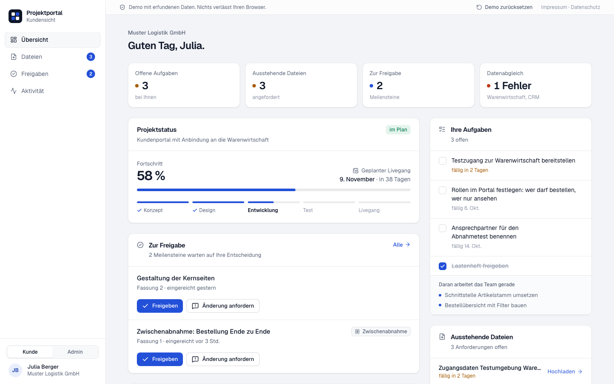 | 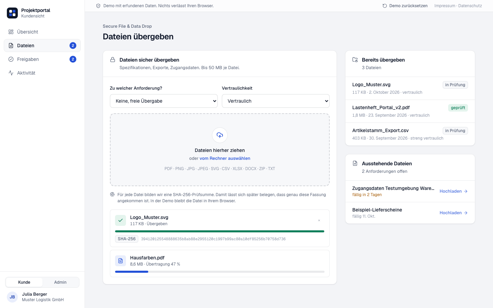 |
| **Freigaben** | **Admin-Sicht** |
| 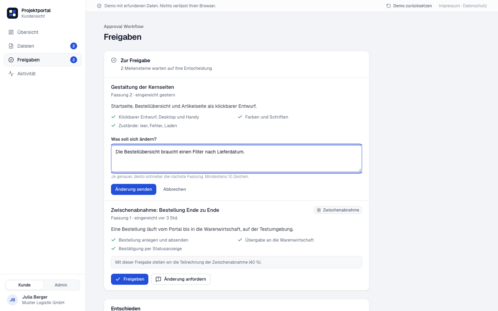 | 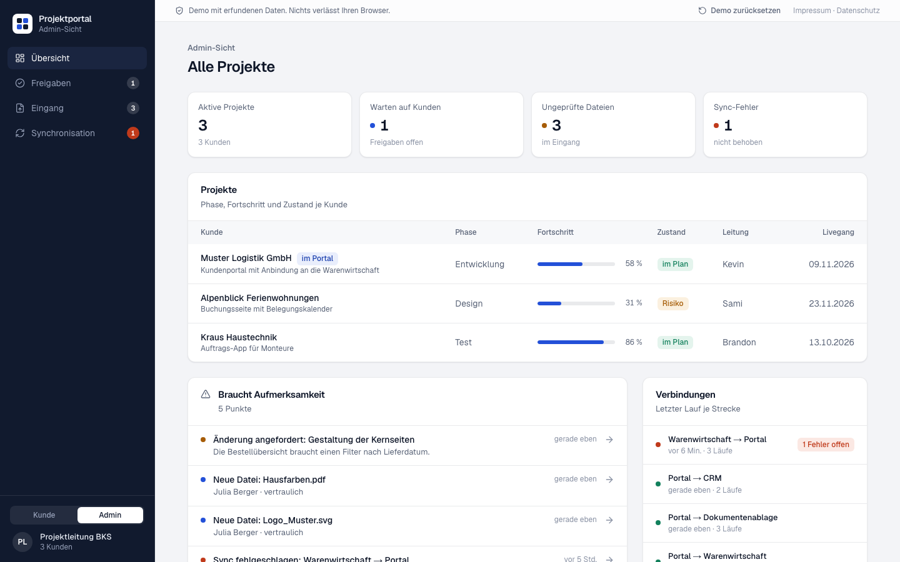 |

**Was die Demo zeigt**

- Übersicht für den Kunden: eigene Aufgaben, angeforderte Unterlagen, Projektphase und geplanter Livegang.
- Dateiübergabe mit Vertraulichkeitsstufe. Für jede Datei wird eine SHA-256-Prüfsumme gebildet, damit sich belegen lässt, welche Fassung angekommen ist.
- Freigaben mit einem Klick, kurz rückgängig zu machen. Wer eine Änderung möchte, schreibt dazu, was sich ändern soll.
- Synchronisationsverlauf: wann welche Daten zwischen Portal, Warenwirtschaft, CRM und Buchhaltung abgeglichen wurden. Fehlgeschlagene Läufe lassen sich in der Admin-Sicht erneut senden.

**Ehrlich gesagt:** Die Demo hat kein Backend. Dateien verlassen den Browser nicht, die Synchronisationen sind simuliert. Sie zeigt Oberfläche und Abläufe, so wie wir sie für ein echtes Projekt bauen würden.

**Technik:** Next.js, TypeScript, Tailwind CSS, Framer Motion. Gehostet in Frankfurt (Vercel).

---

### Puls: API- & Webhook-Monitor

*Eigenentwicklung, Demo*

Überwacht Schnittstellen zwischen Systemen: Shop, Warenwirtschaft, Zahlungsanbieter, Partner. Fällt eine aus oder wird langsam, steht es sofort in der Übersicht, im Vorfall-Protokoll und auf Wunsch in Slack.

**[→ Demo ausprobieren](https://puls.bkstechnologies.de)**: ohne Anmeldung. Eigene öffentliche Adressen werden echt geprüft.

| Übersicht | Vorfall |
|:---:|:---:|
|  | 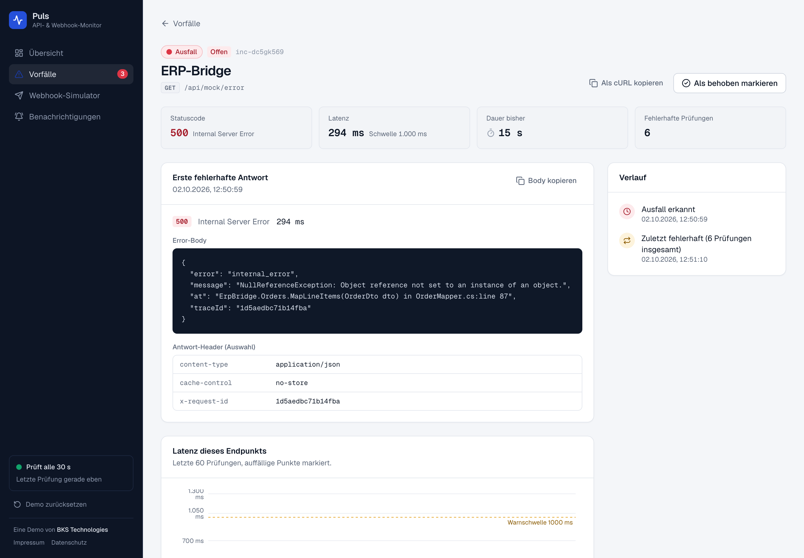 |
| **Simulator** | **Handy** |
| 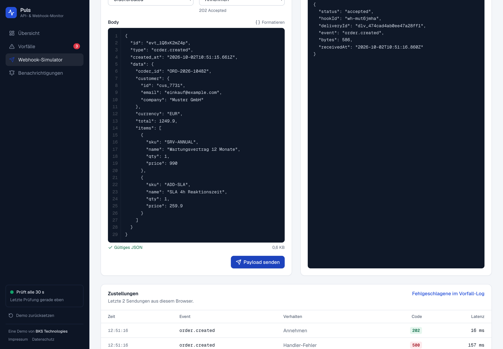 | 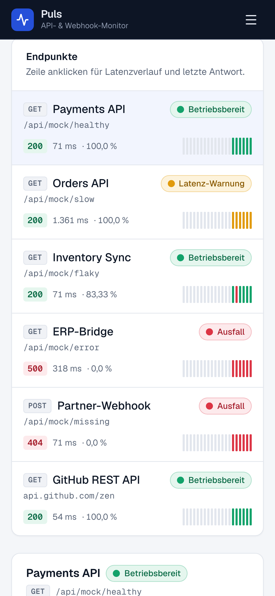 |

**Was die Demo kann**

- Live-Status je Endpunkt mit Latenz, p95, Verfügbarkeit und Verlauf der letzten Prüfungen.
- Vorfall-Protokoll mit Statuscode, Antwortzeit, Fehler-Body und Zeitleiste.
- Webhook-Simulator: Test-Nachrichten senden und sehen, wie der Empfänger antwortet.
- Benachrichtigungen über Slack.

**Technik:** Next.js, TypeScript, Tailwind CSS, Recharts. Prüfungen laufen auf dem Server, geschützt gegen Zugriffe ins interne Netz. Gehostet in Frankfurt (Vercel).

---

### Datenmapper: Daten sauber in ein anderes System übernehmen

*Eigenentwicklung, Demo*

CSV- oder JSON-Datei einlesen, Spalten den Feldern des Zielsystems zuordnen, Fehler vor dem Import sichtbar machen und die gültigen Datensätze paketweise übertragen. Für den Moment, in dem ein Betrieb von Excel oder einer alten Software auf ein neues System umzieht.

**[→ Demo ausprobieren](https://datenmapper.bkstechnologies.de)**: mit Beispieldatei, ohne Anmeldung. Die Datei wird nur im Browser gelesen.

| Import | Zuordnung |
|:---:|:---:|
| 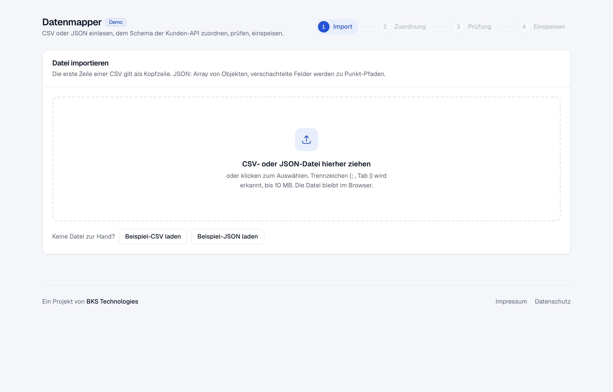 | 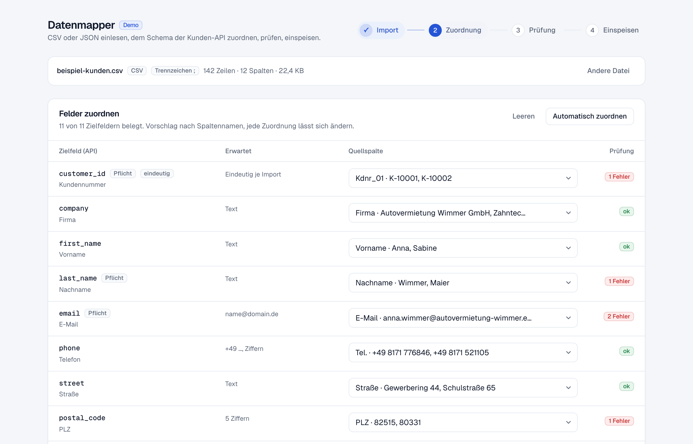 |
| **Prüfung** | **Übertragung** |
|  |  |

**Was die Demo kann**

- CSV mit erkanntem Trennzeichen und JSON, auch verschachtelt. Bis 10 MB.
- Zuordnungsvorschlag nach Spaltennamen, etwa `Kdnr_01` → `customer_id`. Pflichtfelder ohne Quelle sperren den nächsten Schritt.
- Prüfung vor dem Import: Pflichtfelder, E-Mail, PLZ, Telefon, Datum (auch der 31.02.), Beträge, Dubletten. Rote Zellen lassen sich per Klick korrigieren.
- Übertragung in Paketen mit Wiederholung bei Ausfall, Abbruch jederzeit, Protokoll und Fehlerbericht zum Herunterladen.

**Ehrlich gesagt:** Das Zielsystem ist simuliert. Es prüft und antwortet wie eine echte Schnittstelle, speichert aber nichts. Für ein echtes Projekt wird es gegen die API des Kunden ausgetauscht.

**Technik:** Next.js, TypeScript, Tailwind CSS, Vitest. Gehostet in Frankfurt (Vercel).

---

### Abgleich: Shop, Warenwirtschaft, CRM und Buchhaltung im Gleichtakt

*Demo-Projekt, Oktober 2026*

Eine Bestellung kommt im Shop an und muss in die Warenwirtschaft, ein Kontakt ändert sich im CRM und muss ins zweite CRM, eine Zahlung muss in die Buchhaltung. Abgleich zeigt, welche Daten gerade zwischen welchen Systemen fließen, was hängt und wo beide Seiten denselben Datensatz unterschiedlich geändert haben. Diese Konflikte entscheidet ein Mensch mit einem Klick.

**[→ Demo ausprobieren](https://abgleich.bkstechnologies.de)**: erfundene Firmen mit Beispieldaten, ohne Anmeldung.

| Übersicht | Konflikt lösen |
|:---:|:---:|
|  |  |
| **Lauf** | **Handy** |
| 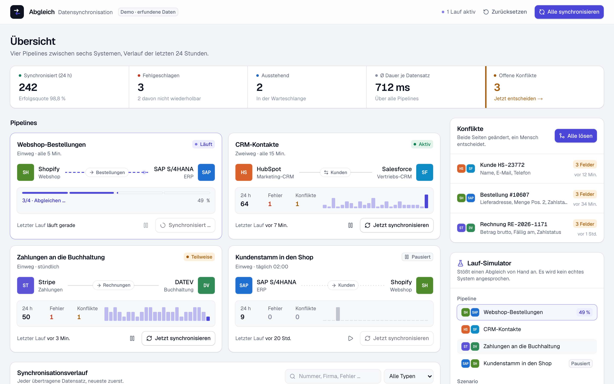 | 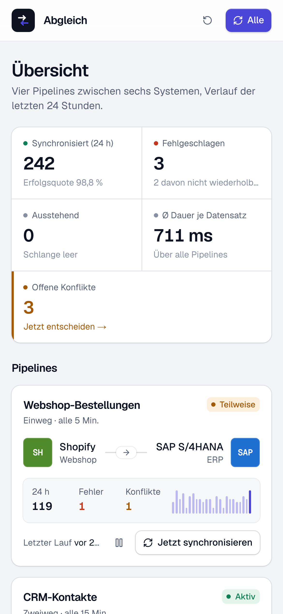 |

**Was die Demo zeigt**

- Pipelines zwischen zwei Systemen mit Zustand, Zahlen der letzten 24 Stunden und Verlauf je Stunde. Pausieren, fortsetzen, von Hand anstoßen.
- Ein Lauf in vier Stufen: Daten holen, umwandeln, abgleichen, schreiben. Jeder Datensatz erscheint sofort im Verlauf und bekommt am Ende sein Ergebnis.
- Verlauf aller Datensätze mit Filter und Suche. Fehlgeschlagene lassen sich erneut senden; liegt die Ursache in den Daten, sagt die Demo das, statt es endlos zu wiederholen.
- Konflikte Feld für Feld: Was steht in System A, was in System B, wer hat zuletzt geändert. Eine Seite behalten oder je Feld das Richtige zusammenführen.

**Ehrlich gesagt:** Die Demo hat kein Backend und spricht kein echtes System an. Läufe, Fehler und Konflikte sind simuliert. Sie zeigt Oberfläche und Abläufe, so wie wir sie für ein echtes Projekt bauen würden.

**Technik:** Next.js, TypeScript, Tailwind CSS, Zustand. Gehostet in Frankfurt (Vercel).

---

### Pforte: altes System vor der Last einer App schützen

*Eigenentwicklung, Demo*

Eine neue Mobile App soll Daten aus einem alten Warenwirtschaftssystem holen, aber das alte System verkraftet die vielen Anfragen nicht und antwortet in einem schwerfälligen Format. Pforte steht dazwischen: begrenzt die Anfragen, beantwortet Wiederholungen aus dem Zwischenspeicher, wandelt die alten Antworten in schlankes JSON um und hat einen Not-Aus für den Ernstfall.

**[→ Demo ausprobieren](https://pforte.bkstechnologies.de)**: ohne Anmeldung, mit simuliertem Verkehr. Einfach „Lastspitze simulieren“ drücken und eingreifen.

| Live-Verkehr | Not-Aus | Umwandlung |
|:---:|:---:|:---:|
| 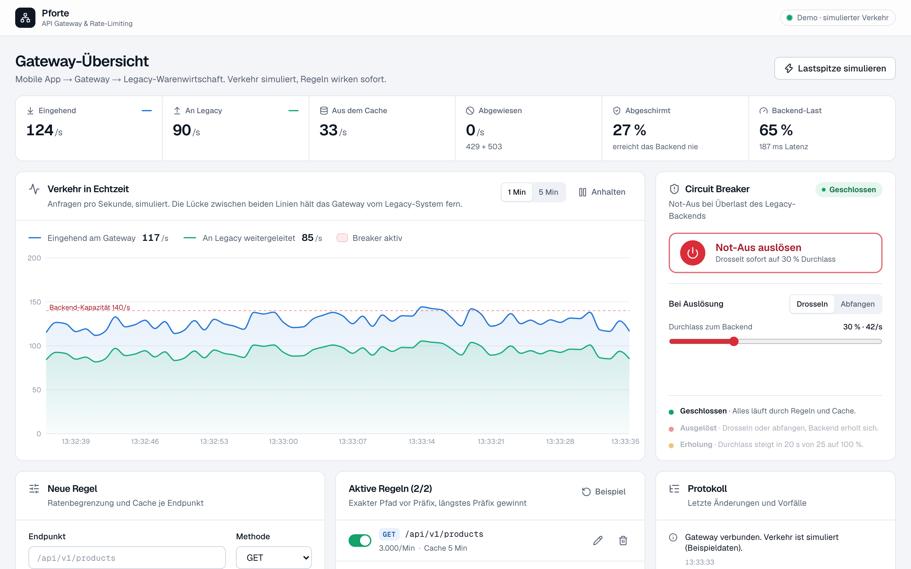 | 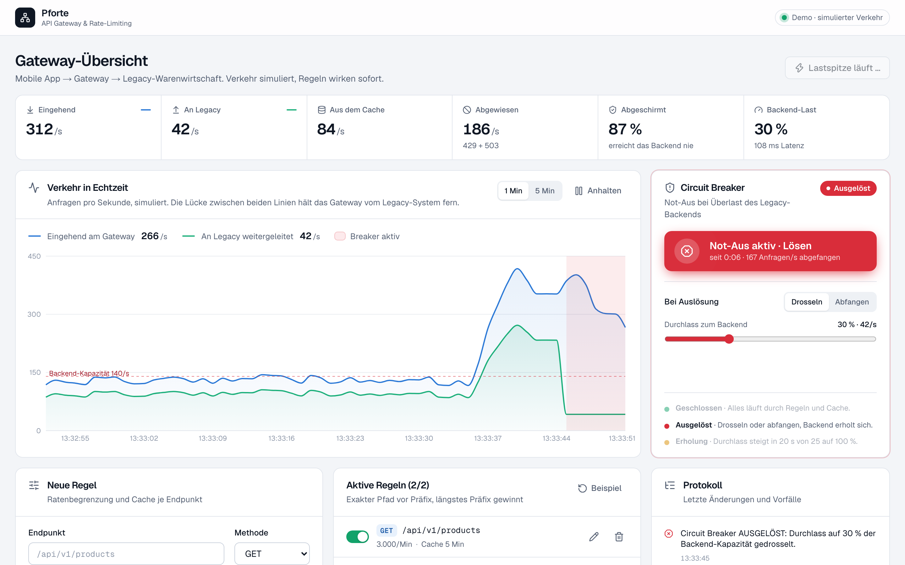 | 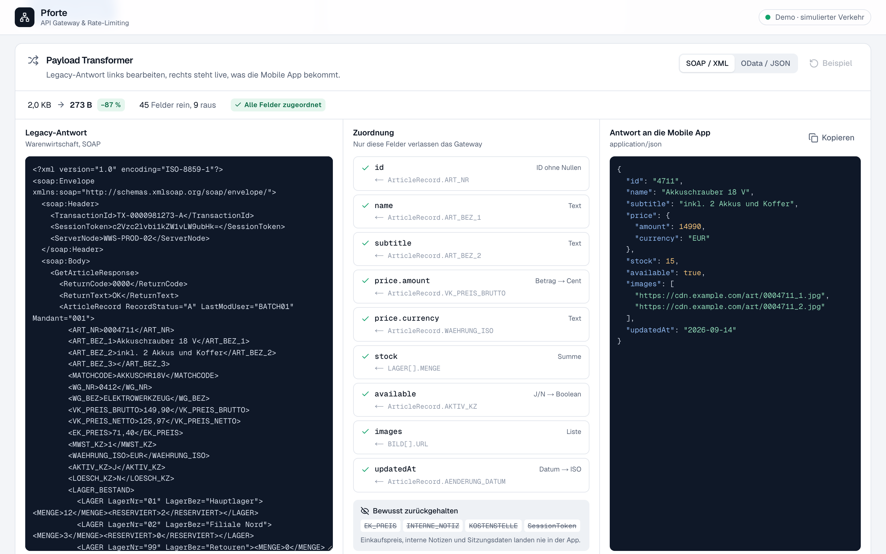 |

**Was die Demo kann**

- Live-Diagramm: eingehende Anfragen gegen die, die beim alten System ankommen, mit Kapazitätsgrenze und Aufschlüsselung je Sekunde.
- Regeln je Endpunkt: Höchstzahl pro Sekunde, Minute oder Stunde und Zwischenspeicher-Dauer. Die Wirkung steht schon vor dem Speichern da.
- Umwandlung alter SOAP/XML- oder OData-Antworten in schlankes JSON. Einkaufspreise und interne Notizen verlassen das Gateway nie.
- Not-Aus (Circuit Breaker): drosseln oder komplett abfangen, danach stufenweises Hochfahren, damit das alte System nicht sofort wieder umfällt.

**Technik:** Next.js, React, TypeScript, Tailwind CSS, Recharts. Der Verkehr ist in der Demo simuliert, es wird kein echtes System angesprochen. Gehostet in Frankfurt (Vercel).

---

Sie möchten so etwas für Ihren Betrieb? **[Erstgespräch anfragen](https://bkstechnologies.de/#kontakt)**
