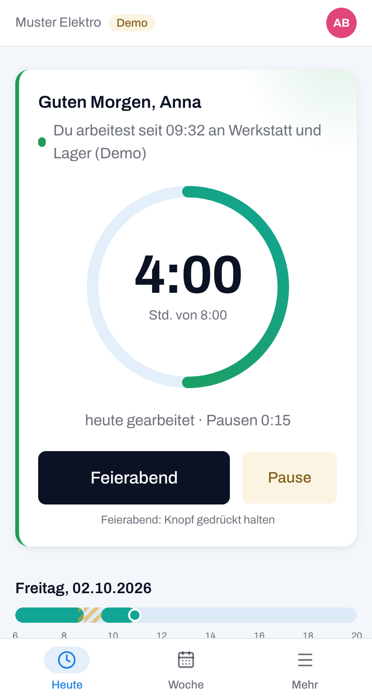
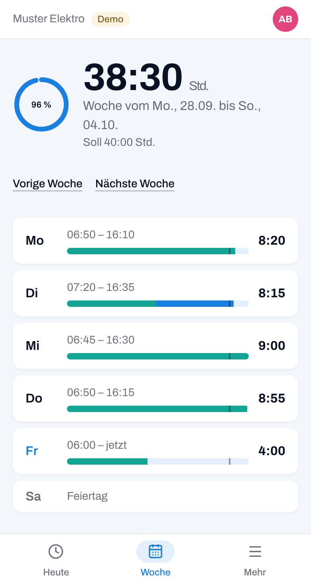
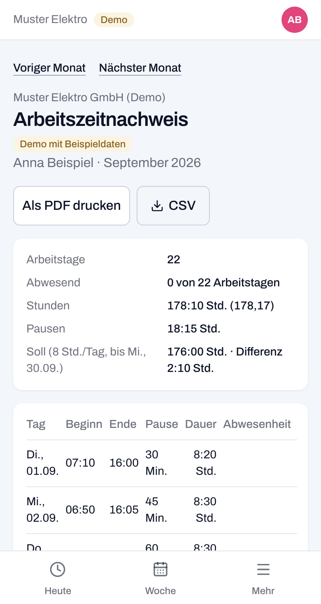
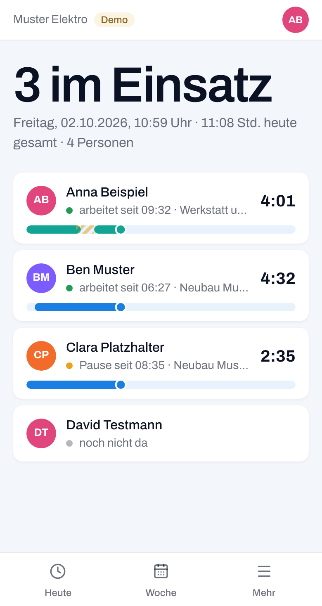

# BKS Technologies

**We build digital solutions.** Websites, Web-Anwendungen und Apps für Betriebe mit 5 bis 50 Mitarbeitern. Aus Geretsried bei München.

[bkstechnologies.de](https://bkstechnologies.de) · [info@bkstechnologies.de](mailto:info@bkstechnologies.de)

---

## Projekte

### Stunden: Zeiterfassung für kleine Betriebe

*Eigenentwicklung, live seit Oktober 2026*

Mitarbeiter stempeln am Handy, der Betrieb bekommt den Arbeitszeitnachweis fertig zum Drucken. Von uns entworfen, gebaut und betrieben.

**[→ Demo ausprobieren](https://stunden.bkstechnologies.de)**: erfundener Betrieb mit Beispieldaten, ohne Anmeldung.

| Heute | Woche | Nachweis | Team |
|:---:|:---:|:---:|:---:|
|  |  |  |  |

**Was die App kann**

- Stempeln am Handy, als App auf dem Home-Bildschirm. Ohne Netz wird gespeichert und später nachgesendet.
- Arbeitszeitnachweis je Person und Monat, als PDF zum Drucken oder als CSV.
- Urlaub, Krank und Frei, dazu die Feiertage in Bayern. Das Soll rechnet sich selbst.
- Hinweis, wenn Pausen nach § 4 Arbeitszeitgesetz fehlen.
- Team-Tafel für den Inhaber: wer gerade arbeitet, wer Pause hat, wer noch nicht da ist.
- Projekte mit Stunden je Tätigkeit und Person. Jede Änderung steht im Protokoll.

**Warum:** Seit dem Beschluss des Bundesarbeitsgerichts vom September 2022 müssen Arbeitgeber die Arbeitszeit erfassen. Viele kleine Betriebe machen das noch auf Papier oder in Excel.

**Technik:** Next.js, TypeScript, PostgreSQL. Gehostet in Frankfurt (Vercel, Neon). Der Quellcode ist nicht öffentlich.

---

Sie möchten so etwas für Ihren Betrieb? **[Erstgespräch anfragen](https://bkstechnologies.de/#kontakt)**
